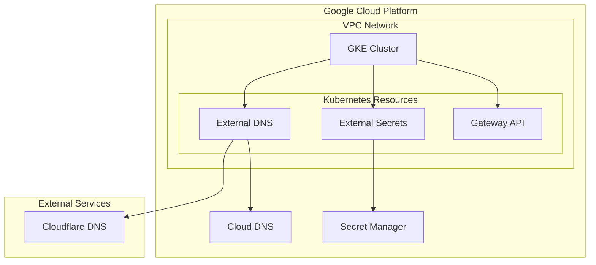

# google-cloud-terraform

Google Cloud Platform上にKubernetesクラスタ(GKE)を構築し、以下のコンポーネントを導入するためのTerraformコードです。

- External DNS
- External Secrets
- Gateway API

## インフラ構成図



## 前提条件

- Terraform >= 1.0
- Terragrunt
- Google Cloud SDKのインストールと認証設定
- `gcloud` CLIツール
- `kubectl` CLIツール
- `helmfile` CLIツール

## セットアップ手順

1. 環境変数の設定
```bash
# terraform.tfvars.exampleをコピーして必要な値を設定
cp terraform.tfvars.example terraform.tfvars
```

2. Terraformの初期化と実行
```bash
# tfstateバケットの作成
cd terraform/_tfstate
terragrunt init
terragrunt apply

# 共通設定の適用
cd ../common
terragrunt init
terragrunt apply

# VPCの作成
cd ../vpc
terragrunt init
terragrunt apply

# GKEクラスタの作成
cd ../gke
terragrunt init
terragrunt apply

# その他のコンポーネントの作成
cd ../cloud-dns
terragrunt init
terragrunt apply

cd ../external-dns
terragrunt init
terragrunt apply

cd ../external-secrets
terragrunt init
terragrunt apply
```

3. Kubernetesリソースのデプロイ
```bash
# GKEクラスタの認証情報を取得
gcloud container clusters get-credentials [CLUSTER_NAME] --region [REGION] --project [PROJECT_ID]

# Helmfileを使用してコンポーネントをデプロイ
cd k8s/external-dns
helmfile sync

cd ../external-secrets
helmfile sync

cd ../gateway-api
helmfile sync
```

## ディレクトリ構造

```
.
├── k8s/                    # Kubernetes関連の設定
│   ├── common/            # 共通のKubernetesリソース
│   ├── external-dns/      # External DNS Helm Chart設定
│   ├── external-secrets/  # External Secrets Helm Chart設定
│   ├── gateway-api/      # Gateway API設定
│   └── sample/           # サンプルアプリケーション
└── terraform/             # Terraformコード
    ├── _tfstate/         # tfstate用GCSバケット設定
    ├── cloud-dns/        # Cloud DNS設定
    ├── common/           # 共通のGCPリソース設定
    ├── external-dns/     # External DNS用IAM設定
    ├── external-secrets/ # External Secrets用IAM設定
    ├── gke/             # GKEクラスタ設定
    └── vpc/             # VPCネットワーク設定
```

## ライセンス

MIT
