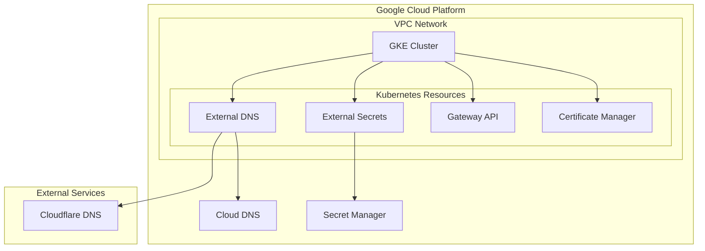

# google-cloud-labo

メモ: [GKE を構築して色々セットアップする- Zenn](https://zenn.dev/daylight55/scraps/0432c59da98a06)

Google Cloud Platform 上に Kubernetes クラスタ(GKE)を構築し、以下のコンポーネントを導入するための Terraform コードです。

- External DNS
- External Secrets
- Gateway API
- Certificate Manager

## インフラ構成図



## 前提条件

- mise
- Terraform >= 1.0
- Terragrunt
- Google Cloud SDK のインストールと認証設定
- `gcloud` CLI ツール
- `kubectl` CLI ツール
- `helmfile` CLI ツール

## セットアップ手順

1. 環境変数の設定

```bash
# terraform.tfvars.exampleをコピーして必要な値を設定
cp terraform.tfvars.example terraform.tfvars

# env.yaml.exampleをコピーして必要な値を設定
cp env.yaml.example env.yaml
```

env.yamlで設定が必要な値：

| 設定項目 | 説明 | 例 |
|----------|------|-----|
| project | GCPプロジェクトID | my-project-id |
| region | GCPリージョン | us-west1 |
| zone | GCPゾーン | us-west1-c |
| prefix | リソース名のプレフィックス（任意） | dev |
| tfstate_bucket | Terraformの状態を保存するGCSバケット名 | my-tfstate-bucket |
| domain | 使用するドメイン | example.com |
| subdomain | 使用するサブドメイン | dev |
| cloudflare_api_token | CloudflareのAPIトークン | xxxxx |
| repository_name | ArgoCDで使用するリポジトリ名 | my-repo |

設定例：
```yaml
project: 'my-project-id'
region: 'us-west1'
zone: 'us-west1-c'
prefix: 'dev'
tfstate_bucket: 'my-tfstate-bucket'
domain: 'example.com'
subdomain: 'dev'
cloudflare_api_token: 'xxxxx'
repository_name: 'my-repo'
```

2. Terraform の初期化と実行

```bash
# tfstateバケットの作成
cd terraform/_tfstate
terragrunt init
terragrunt apply

# 共通設定の適用
cd ../common
terragrunt init
terragrunt apply

# VPCの作成
cd ../vpc
terragrunt init
terragrunt apply

# GKEクラスタの作成
cd ../gke
terragrunt init
terragrunt apply

# その他のコンポーネントの作成
cd ../cloud-dns
terragrunt init
terragrunt apply

cd ../external-dns
terragrunt init
terragrunt apply

cd ../external-secrets
terragrunt init
terragrunt apply

cd ../certificate-manager
terragrunt init
terragrunt apply
```

3. Kubernetes リソースのデプロイ

```bash
# GKEクラスタの認証情報を取得
gcloud container clusters get-credentials [CLUSTER_NAME] --region [REGION] --project [PROJECT_ID]

# Helmfileを使用してコンポーネントをデプロイ
cd k8s/external-dns
helmfile sync

cd ../external-secrets
helmfile sync

cd ../gateway-api
helmfile sync
```

## ディレクトリ構造

```
.
├── k8s/                    # Kubernetes関連の設定
│   ├── common/            # 共通のKubernetesリソース
│   ├── external-dns/      # External DNS Helm Chart設定
│   ├── external-secrets/  # External Secrets Helm Chart設定
│   ├── gateway-api/      # Gateway API設定
│   └── sample/           # サンプルアプリケーション
└── terraform/             # Terraformコード
    ├── _tfstate/         # tfstate用GCSバケット設定
    ├── certificate-manager/ # Certificate Manager設定
    ├── cloud-dns/        # Cloud DNS設定
    ├── common/           # 共通のGCPリソース設定
    ├── external-dns/     # External DNS用IAM設定
    ├── external-secrets/ # External Secrets用IAM設定
    ├── gke/             # GKEクラスタ設定
    └── vpc/             # VPCネットワーク設定
```

## ライセンス

MIT

## メモ

依存関係の Graph 図生成

```
terragrunt graph-dependencies | dot -Tsvg -Nshape=rect -Gsplines=ortho -o graph.svg
```
