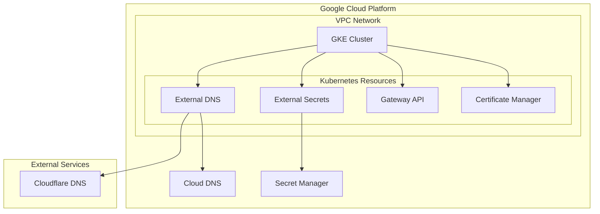

# google-cloud-labo

メモ: [GKE を構築して色々セットアップする- Zenn](https://zenn.dev/daylight55/scraps/0432c59da98a06)

Google Cloud Platform 上に Kubernetes クラスタ(GKE)を構築し、以下のコンポーネントを導入するための Terraform コードです。

- External DNS
- External Secrets
- Gateway API
- Certificate Manager

## インフラ構成図



## 前提条件

ここで使用するツール群は[jdx/mise](https://github.com/jdx/mise) でインストールできます。

```
cd <this repository>
mise install
```

使用するツール・バージョンについては[.mise.toml](/.mise.toml)を参照してください。

## セットアップ手順

1. 環境変数の設定

```bash
# env.yaml.exampleをコピーして必要な値を設定
cp env.yaml.example env.yaml
```

env.yaml で設定が必要な値：

| 設定項目             | 説明                                      | 例                |
| -------------------- | ----------------------------------------- | ----------------- |
| project              | GCP プロジェクト ID                       | my-project-id     |
| region               | GCP リージョン                            | us-west1          |
| zone                 | GCP ゾーン                                | us-west1-c        |
| prefix               | リソース名のプレフィックス（任意）        | dev               |
| tfstate_bucket       | Terraform の状態を保存する GCS バケット名 | my-tfstate-bucket |
| domain               | 使用するドメイン                          | example.com       |
| subdomain            | 使用するサブドメイン                      | dev               |
| cloudflare_api_token | Cloudflare の API トークン                | xxxxx             |
| repository_name      | ArgoCD で使用するリポジトリ名             | my-repo           |

設定例：

```yaml
project: 'my-project-id'
region: 'us-west1'
zone: 'us-west1-c'
prefix: 'dev'
tfstate_bucket: 'my-tfstate-bucket'
domain: 'example.com'
subdomain: 'dev'
cloudflare_api_token: 'xxxxx'
repository_name: 'my-repo'
```

2. Terraform & K8s の初期化とデプロイ

tfstate バケットの作成のみ別途必要。

```bash
cd terraform/_tfstate
terraform init
terraform apply
```

Terraform & K8s をまとめてデプロイします。

```bash
task apply
```

## ディレクトリ構造

```
.
├── k8s/                    # Kubernetes関連の設定
│   ├── common/            # 共通のKubernetesリソース
│   ├── external-dns/      # External DNS Helm Chart設定
│   ├── external-secrets/  # External Secrets Helm Chart設定
│   ├── gateway-api/      # Gateway API設定
│   └── sample/           # サンプルアプリケーション
└── terraform/             # Terraformコード
    ├── _tfstate/         # tfstate用GCSバケット設定
    ├── certificate-manager/ # Certificate Manager設定
    ├── cloud-dns/        # Cloud DNS設定
    ├── common/           # 共通のGCPリソース設定
    ├── external-dns/     # External DNS用IAM設定
    ├── external-secrets/ # External Secrets用IAM設定
    ├── gke/             # GKEクラスタ設定
    └── vpc/             # VPCネットワーク設定
```

## ライセンス

MIT

## メモ

依存関係の Graph 図生成

```
terragrunt graph-dependencies | dot -Tsvg -Nshape=rect -Gsplines=ortho -o graph.svg
```
